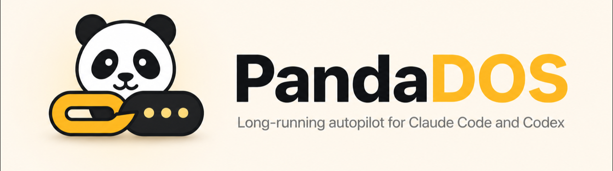
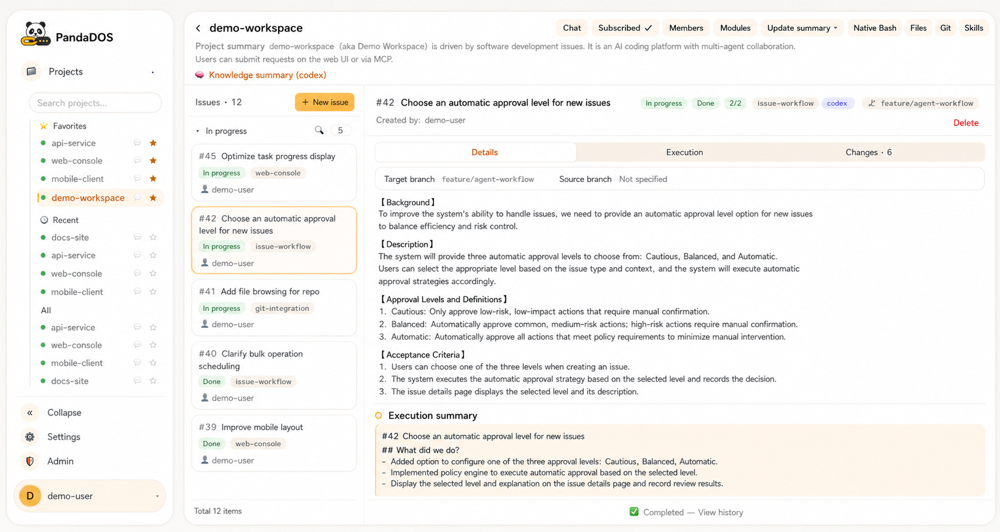
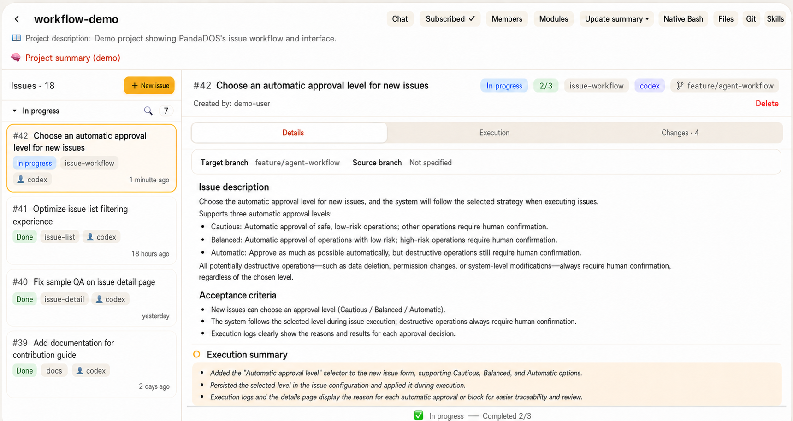

# PandaDOS — Long-running autopilot for Claude Code and Codex

<p align="center">
  
</p>

PandaDOS is an open-source, self-hosted control plane that turns Claude Code and Codex into
long-running, issue-driven coding agents. You define outcomes and make the important product or
architecture decisions; PandaDOS keeps the queue moving, preserves context, handles routine
approvals, watches progress, records results, and brings you back only when a real decision is
needed.

[简体中文](README.zh-CN.md)

[Why PandaDOS](#why-pandados) · [Quick start](#quick-start) ·
[Your first 10 minutes](#your-first-10-minutes) · [How it works](#how-it-works) ·
[24/7 deployment](#run-pandados-247) · [Security](#security)



> The workspace, users, issues, branches, and project names in the screenshots are sanitized demo
> data.

## Why PandaDOS

Claude Code and Codex are excellent native coding agents. PandaDOS does not replace them or hide
their terminals. It adds the operating system around them:

- **Work is driven by issues, not repeated chat prompts.** Queue outcomes, acceptance criteria, and
  priorities, then let the agent continue through planning, implementation, verification, and
  delivery.
- **Long-running automation stays observable.** Follow the real Claude Code or Codex conversation,
  terminal, files, Git changes, approvals, and execution summary from a browser or phone.
- **Routine confirmations stop consuming your day.** Choose cautious, balanced, or automatic
  approval. Safe, reversible work can continue automatically; destructive, irreversible,
  production, secret-related, and genuinely ambiguous decisions still come back to you.
- **Context survives beyond one task.** Projects, modules, reusable agent conversations, issue
  summaries, and repository knowledge give later work a durable starting point.
- **The queue keeps moving.** PandaDOS can clarify a request, run it, recover after interruption,
  commit and push according to project policy, summarize the result, and hand useful context to the
  next issue.

The goal is not to remove people from software development. It is to free you from continuous
supervision so you can focus on product direction, system design, review, and the decisions that
actually need judgment.

## Quick start

### Recommended setup

For occasional local use, run PandaDOS on your Mac or Linux workstation. For continuous operation,
use a small cloud host that stays online, run PandaDOS as a system service, and attach local or
remote executors over SSH. This lets issue queues continue while your laptop is closed.

The control plane requires Bun, Git, tmux, and a writable `~/.panda/`. Every executor requires Git,
tmux, and an authenticated Claude Code or Codex CLI. An OpenAI-compatible driver model is strongly
recommended for clarification, PM decisions, summaries, and approval explanations.

### Ask Claude Code or Codex to install it

Paste this prompt into Claude Code or Codex on the machine where you want PandaDOS to run:

```text
Install PandaDOS for me from https://github.com/uniquechao/PandaDOS.git.

Before changing anything:
1. Inspect the operating system, current user, available ports, Bun, Git, tmux, Claude Code, Codex,
   systemd, and any existing reverse proxy.
2. Read README.md and DEPLOY.md in the repository and use them as the source of truth.
3. Explain the exact installation plan and ask before any destructive change, firewall change,
   package removal, or replacement of an existing service or proxy configuration.

Then:
- Clone or update PandaDOS in a dedicated directory.
- Install dependencies, run the localization check, type check, tests, and UI build.
- Keep PandaDOS bound to 127.0.0.1:8802.
- Start it and verify /healthz.
- If systemd is available, install a restart-on-failure service using the DEPLOY.md example and
  preserve tmux agent processes when the control plane restarts.
- If remote access is requested, configure a trusted nginx or Caddy reverse proxy with TLS,
  authentication, and WebSocket forwarding. Never expose port 8802 directly to the public internet.
- Tell me where the one-time admin token was written, but do not print, upload, or transmit secrets.
- Finish with the login URL, service status, health-check result, and any manual steps still needed
  to authenticate Claude Code or Codex.
```

### Install manually

```bash
git clone https://github.com/uniquechao/PandaDOS.git
cd PandaDOS
bun install --frozen-lockfile
bun run check-i18n
bun run typecheck
bun test
bun run build-ui
bun run start
```

Open `http://127.0.0.1:8802`. On first start, PandaDOS creates the administrator account and
writes its one-time token to `~/.panda/admin-token` with mode `0600`.

For systemd, reverse proxies, environment variables, SSH executors, health checks, and routine
operations, follow [DEPLOY.md](DEPLOY.md).

## Your first 10 minutes

1. **Sign in.** Use the one-time administrator token created during the first start.
2. **Check the executor.** In Admin, confirm that the always-on host or SSH machine can find the
   Claude Code or Codex CLI and its authenticated state.
3. **Configure the driver model.** Add an OpenAI-compatible endpoint in Admin if you want PM-assisted
   clarification, summaries, approval explanations, and project understanding.
4. **Import existing work or create a project.**
   - Select **Import**, choose Claude or Codex, and pick an existing local project to attach its
     working directory and available conversation history.
   - Choose tmux to register a session that is already running.
   - Select **New project** to clone a Git repository or create a blank workspace.
5. **Choose how to work.**
   - Use an **issue project** for queued, traceable delivery. Create an issue with the outcome,
     relevant context, and acceptance criteria; PandaDOS handles the execution stages.
   - Use a **chat project** for exploratory work or one-off changes. Create a conversation and work
     directly with Claude Code or Codex without an issue queue.
6. **Set the approval level.** Start with balanced mode, review what PandaDOS approves automatically,
   and increase automation only when the repository and executor are properly isolated.
7. **Leave the queue running.** Watch from the browser or phone, answer genuine clarification
   requests, and spend the rest of your time on design and review.

## How it works

```text
You define outcomes and priorities
                │
                ▼
      PandaDOS issue queue and PM
                │
                ├── clarify missing requirements
                ├── plan and choose an agent
                ├── apply approval policy
                ├── observe progress and recover
                └── summarize and hand off
                │
                ▼
       Local or SSH executor
                │
                ▼
          tmux session
                │
                ▼
       Claude Code or Codex
```



Each issue is a traceable unit of work. Independent projects can run separately; work sharing one
repository is serialized to reduce conflicting edits. A module can keep one assigned agent and
reuse a long-lived logical conversation across sequential issues.

### Approval and safety model

- **Cautious** minimizes automatic approval.
- **Balanced** automatically accepts common safe and reversible development actions.
- **Automatic** lets routine work continue with minimal interruption.
- Destructive data loss, history rewrites, production operations, secrets, shutdowns, and ambiguous
  choices remain protected regardless of convenience settings.

PandaDOS exposes the native agent session instead of inventing a second execution engine. You can
inspect and intervene at any time.

## What you get

- Issue queue, clarification, planning, execution stages, review gates, result summaries, and handoff
- Claude Code and Codex capability detection with project-, module-, and issue-level selection
- Persistent module conversations and project knowledge
- Browser workspace for chat, native terminal, files, images, Git history, diffs, and progress
- Local and SSH executors
- Project members, subscriptions, same-company Feishu login/binding, private project Q&A, notifications, and approval cards
- Ten UI locales with localized product text while preserving issues, code, commands, paths,
  terminal output, Git data, and existing conversation history verbatim

## Feishu integration

Configure a company app in **Admin → Feishu** to let colleagues sign in with their own identities,
select an authorized project in bot private chat, ask the project PM questions, and receive
subscription notifications and approval cards. Login and messaging have independent switches;
the admin page provides credential verification, connection status, reconnection, and a test
message to the current administrator's linked account.

See the [Feishu setup and user guide (Chinese)](docs/feishu.md) for permissions, setup, private-chat
commands, configuration precedence, troubleshooting, and current limitations.

## Run PandaDOS 24/7

An always-on deployment is the best fit for long issue queues:

1. Use a cloud host or other machine that will not sleep.
2. Run PandaDOS under systemd with restart-on-failure.
3. Keep the HTTP service on `127.0.0.1:8802`.
4. Put nginx or Caddy in front with TLS, strong authentication, and WebSocket forwarding.
5. Register the same host as a local executor, or connect dedicated executor machines through SSH.
6. Confirm that Claude Code or Codex is authenticated for the service account and that its workspace
   permissions are intentionally limited.
7. Back up `~/.panda/` with a WAL-aware SQLite backup method and monitor `/healthz`.

Do not restart the control plane while an issue is actively changing a repository unless necessary.
See [DEPLOY.md](DEPLOY.md) for the maintained service and operations reference.

## Architecture

```text
core ← executor ← issues ← agents
  ↑
web / notify
```

| Directory | Responsibility |
| --- | --- |
| `src/core/` | SQLite, migrations, users, conversations, files, skills, and project data |
| `src/executor/` | Local and SSH executor boundary |
| `src/issues/` | State machine, queue, modules, clarification, and execution engine |
| `src/agents/` | Driver-model client, PM decisions, progress, and approval policies |
| `src/notify/` | Subscriptions, aggregation, and notification channels |
| `src/web/` | HTTP API, WebSocket, terminal bridge, and service composition |
| `ui/` | Preact and Vite browser interface |
| `shared/i18n/` | Typed catalogs, ICU formatting, locale matching, and timezone formatting |

Read the [execution model](docs/execution-model.md) for the runtime architecture and module
boundaries.

## Security

PandaDOS can expose terminals, files, Git operations, and authenticated coding-agent sessions.
Treat access to the web interface as remote shell access.

- Never expose port `8802` directly to the public internet.
- Require TLS and strong authentication at a trusted reverse proxy.
- Never commit or transmit `.env` files, databases, administrator tokens, credentials, SSH private
  keys, or agent session data.
- Use dedicated service and executor accounts with least privilege.
- Review approval policy before enabling higher automation.
- Keep production database diagnosis read-only and use consistent backups.

## Development

```bash
bun run check-i18n
bun run typecheck
bun test
bun run build-ui
```

Read [AGENTS.md](AGENTS.md) and [CLAUDE.md](CLAUDE.md) before contributing.

## License

PandaDOS is licensed under the [Apache License 2.0](LICENSE).
