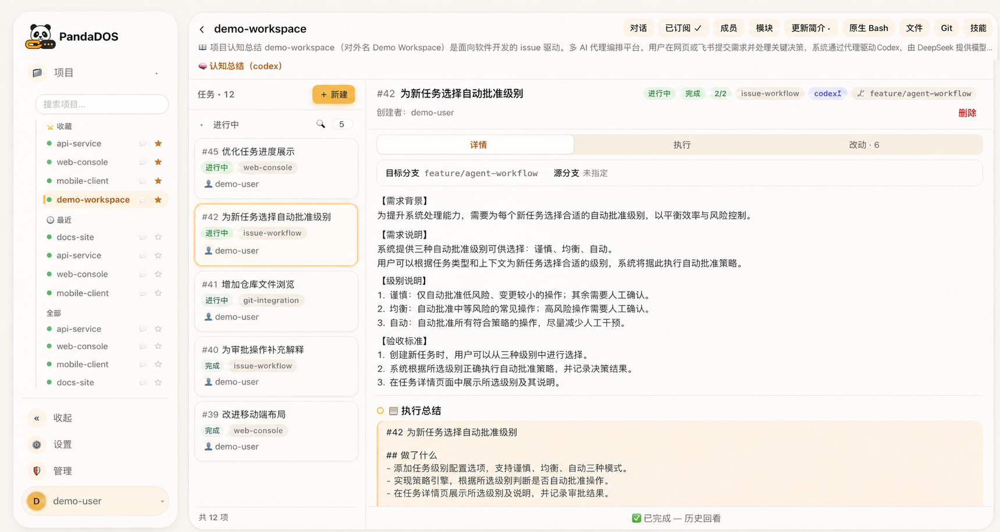
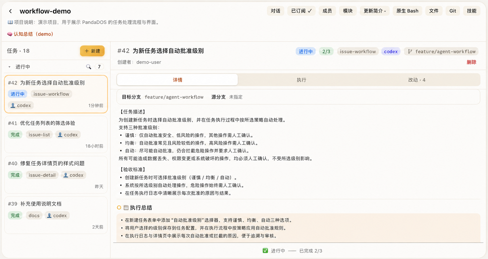

# PandaDOS — Claude Code 与 Codex 的长时间自动驾驶系统

<p align="center">
  
</p>

PandaDOS 是一个开源、自托管的 Agent 编排控制面，让 Claude Code 与 Codex 以 issue 为
驱动长时间自动运行。你负责定义目标、产品方向和关键架构决策；PandaDOS 负责持续推进
队列、保留上下文、处理日常确认、观察进度、记录结果，只在真正需要判断时再把你请回来。

[English](README.md)

[为什么需要 PandaDOS](#为什么需要-pandados) · [快速开始](#快速开始) ·
[新手十分钟上手](#新手十分钟上手) · [工作原理](#工作原理) ·
[24-小时运行](#让-pandados-24-小时运行) · [安全](#安全)



> 截图中的工作区、用户、issue、分支和项目名称均为脱敏演示数据。

## 为什么需要 PandaDOS

Claude Code 与 Codex 是优秀的原生编程 Agent。PandaDOS 不替代它们，也不隐藏它们的
终端，而是在原生 Agent 之上补齐一套持续运行的操作系统：

- **由 issue 驱动，而不是反复发送聊天指令。** 你把目标、验收标准和优先级放进队列，
  Agent 就能持续完成规划、实现、验证和交付。
- **长时间自动运行仍然可观察。** 你可以从浏览器或手机查看真实的 Claude Code/Codex
  对话、终端、文件、Git 改动、审批记录和执行总结。
- **日常确认不再占满注意力。** 选择谨慎、均衡或自动批准级别，让安全、可撤销的操作
  自动继续；数据删除、历史改写、生产操作、密钥和真正含糊的选择仍会交给你确认。
- **上下文不会随单次任务结束而消失。** 项目、模块、可复用 Agent 对话、issue 总结和
  仓库知识为后续任务提供长期记忆。
- **队列会自己向前走。** PandaDOS 可以澄清需求、执行任务、从中断中恢复、按项目策略
  commit/push、总结结果，并把有效上下文接力给下一条 issue。

目标不是让人退出软件开发，而是让你摆脱持续盯守，把时间放回产品设计、系统架构、评审
和真正需要判断的决策。

## 快速开始

### 推荐运行方式

偶尔使用时，可以在自己的 macOS 或 Linux 电脑上运行 PandaDOS。若要让队列持续推进，
建议准备一台不会休眠、长期在线的云主机，把 PandaDOS 作为系统服务运行，再通过本机或
SSH 执行机连接 Claude Code/Codex。这样即使合上笔记本，Agent 仍可继续工作。

控制面需要 Bun、Git、tmux 和可写的 `~/.panda/`。每台执行机都需要 Git、tmux，以及
已经完成登录的 Claude Code 或 Codex CLI。若要使用需求澄清、PM 判断、总结和审批解释，
强烈建议配置 OpenAI-compatible 驱动大模型。

### 让 Claude Code 或 Codex 帮你安装

把下面这段 prompt 直接贴给准备安装 PandaDOS 的机器上的 Claude Code 或 Codex：

```text
请帮我安装 PandaDOS，仓库地址是 https://github.com/uniquechao/PandaDOS.git。

修改任何内容前：
1. 检查操作系统、当前用户、可用端口、Bun、Git、tmux、Claude Code、Codex、systemd
   和现有反向代理。
2. 克隆仓库后先阅读 README.zh-CN.md 与 DEPLOY.zh-CN.md，并以它们为准。
3. 先说明完整安装方案；删除文件、修改防火墙、移除软件包、覆盖现有服务或代理配置前
   必须向我确认。

然后：
- 将 PandaDOS 克隆或更新到独立目录。
- 安装依赖，依次运行国际化检查、类型检查、测试和 UI 构建。
- 保持 PandaDOS 只监听 127.0.0.1:8802。
- 启动服务并验证 /healthz。
- 如果系统支持 systemd，参考 DEPLOY.zh-CN.md 安装自动重启服务，并确保重启控制面时
  不会结束 tmux 中的 Agent 进程。
- 如需远程访问，使用可信的 nginx 或 Caddy 配置 TLS、身份认证和 WebSocket 转发；
  绝不能把 8802 端口直接暴露到公网。
- 告诉我一次性 admin token 写入了哪个文件，但不要打印、上传或传输任何密钥。
- 最后给出登录地址、服务状态、健康检查结果，以及仍需手动完成的 Claude Code/Codex
  登录步骤。
```

### 手动安装

```bash
git clone https://github.com/uniquechao/PandaDOS.git
cd PandaDOS
bun install --frozen-lockfile
bun run check-i18n
bun run typecheck
bun test
bun run build-ui
bun run start
```

打开 `http://127.0.0.1:8802`。首次启动时，PandaDOS 会创建管理员账号，并将仅显示
一次的 token 以 `0600` 权限写入 `~/.panda/admin-token`。

systemd、反向代理、环境变量、SSH 执行机、健康检查和日常运维请以
[中文部署指南](DEPLOY.zh-CN.md)为准。

## 新手十分钟上手

1. **登录。** 使用首次启动时生成的一次性管理员 token。
2. **检查执行机。** 在管理页面确认常开主机或 SSH 机器能找到 Claude Code/Codex CLI，
   并且相应账号已经登录。
3. **配置驱动大模型。** 若要使用 PM 辅助澄清、总结、审批解释和项目认知，请在管理页面
   填入 OpenAI-compatible 接口。
4. **导入已有工作，或新建项目。**
   - 点击**导入**，选择 Claude 或 Codex，再选择现有本地项目，关联它的工作目录与可用
     历史对话。
   - 选择 tmux，可以登记一条已经运行的会话。
   - 点击**新建项目**，可以克隆 Git 仓库或创建空白工作区。
5. **选择工作方式。**
   - **issue 项目**适合排队、追踪和持续交付。新建 issue，写清目标、相关背景和验收标准，
     后续执行阶段由 PandaDOS 推进。
   - **对话项目**适合探索或一次性改动。新建对话后，可以不经过 issue 队列，直接与
     Claude Code 或 Codex 协作。
6. **选择批准级别。** 建议先用均衡模式，确认 PandaDOS 会自动批准哪些操作；只有在仓库
   与执行机隔离充分后，再提高自动化程度。
7. **让队列持续运行。** 你可以通过网页或手机观察，只在真正的澄清请求出现时回答，把
   其余时间用于总体设计和评审。

## 工作原理

```text
你定义目标与优先级
        │
        ▼
PandaDOS issue 队列与 PM
        │
        ├── 澄清缺失需求
        ├── 规划并选择 Agent
        ├── 应用批准策略
        ├── 观察进度并恢复
        └── 总结结果并接力
        │
        ▼
 本机或 SSH 执行机
        │
        ▼
    tmux 会话
        │
        ▼
Claude Code 或 Codex
```



每条 issue 都是可追踪的工作单元。彼此独立的项目可以分别运行；共享同一仓库的工作会
串行执行，以减少修改冲突。模块可以固定一种 Agent，并在连续 issue 之间复用一条长期
逻辑对话。

### 批准与安全边界

- **谨慎**：尽量减少自动批准。
- **均衡**：自动接受常见、安全且可撤销的开发操作。
- **自动**：让日常工作尽量少被打断。
- 数据删除、历史改写、生产操作、密钥、关机和含糊选择不会因为追求方便而失去保护。

PandaDOS 展示原生 Agent 会话，而不是重新发明另一套执行引擎。你随时可以检查和介入。

## 主要能力

- issue 队列、澄清、规划、执行阶段、评审卡点、结果总结和任务接力
- Claude Code/Codex 能力探测，以及项目、模块和 issue 级 Agent 选择
- 模块长期对话与项目知识
- 集成对话、原生终端、文件、图片、Git 历史、diff 和进度的浏览器工作台
- 本机与 SSH 执行机
- 项目成员、订阅、飞书登录/绑定、通知和审批卡片
- 十种 UI 语言；产品文案按用户语言显示，同时逐字保留 issue、代码、命令、路径、
  终端输出、Git 内容和已有对话

## 让 PandaDOS 24 小时运行

长任务队列最适合常开部署：

1. 准备一台不会休眠的云主机或其他常开机器。
2. 使用 systemd 运行 PandaDOS，并配置失败后自动重启。
3. HTTP 服务保持监听 `127.0.0.1:8802`。
4. 在前面使用 nginx 或 Caddy，提供 TLS、强身份认证和 WebSocket 转发。
5. 可以把同一台主机登记为本机执行机，也可以通过 SSH 连接专用执行机。
6. 确认服务账号已登录 Claude Code 或 Codex，并有意限制它能访问的工作区。
7. 使用支持 SQLite WAL 的方式备份 `~/.panda/`，并监控 `/healthz`。

除非确有必要，不要在 issue 正在修改仓库时重启控制面。维护中的服务与运维说明见
[中文部署指南](DEPLOY.zh-CN.md)。

## 技术架构

```text
core ← executor ← issues ← agents
  ↑
web / notify
```

| 目录 | 职责 |
| --- | --- |
| `src/core/` | SQLite、迁移、用户、对话、文件、技能和项目数据 |
| `src/executor/` | 本机与 SSH 执行机边界 |
| `src/issues/` | 状态机、队列、模块、澄清和执行引擎 |
| `src/agents/` | 驱动大模型客户端、PM 判断、进度和批准策略 |
| `src/notify/` | 订阅、聚合和通知通道 |
| `src/web/` | HTTP API、WebSocket、终端桥接和服务装配 |
| `ui/` | Preact 与 Vite 浏览器界面 |
| `shared/i18n/` | 类型化语言目录、ICU 格式化、locale 匹配和时区格式化 |

运行架构与模块边界详见[执行模型](docs/execution-model.zh-CN.md)。

## 安全

PandaDOS 可以提供终端、文件、Git 操作和已登录的编程 Agent 会话。应把 Web 界面的
访问权限视为远程 shell 权限。

- 绝不能把 `8802` 端口直接暴露到公网。
- 通过可信反向代理提供 TLS 和强身份认证。
- 不要提交或传输 `.env`、数据库、管理员 token、凭据、SSH 私钥或 Agent 会话数据。
- 为服务与执行机使用专用账号和最小权限。
- 提高自动化级别前先检查批准策略。
- 生产数据库诊断保持只读，并使用一致性备份。

## 开发验证

```bash
bun run check-i18n
bun run typecheck
bun test
bun run build-ui
```

贡献代码前请阅读 [AGENTS.md](AGENTS.md) 和 [CLAUDE.md](CLAUDE.md)。

## 许可证

PandaDOS 采用 [Apache License 2.0](LICENSE)。
