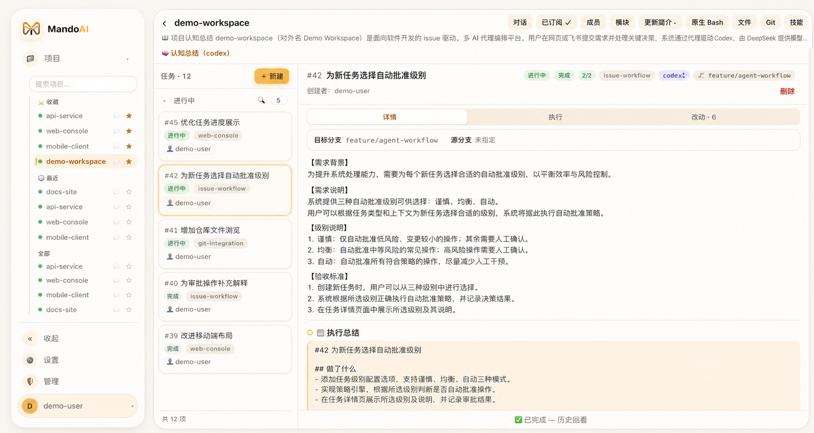
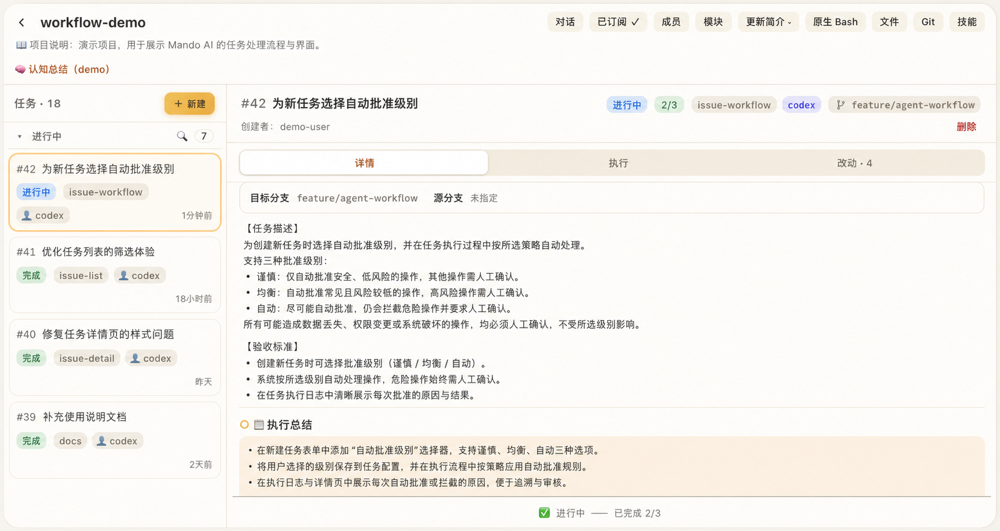

# Mando AI（曼拓）— Issue 驱动的编程代理编排平台

**面向 Claude Code 与 Codex 的自托管控制面。把 Issue 转化为可排队、可观察、可审批的
编程工作流，并通过任意浏览器参与。**

[English](README.md) · [简体中文](README.zh-CN.md)

[快速开始](#快速开始) · [核心特色](#核心特色) · [技术架构](#技术架构) ·
[部署](#部署) · [安全](#安全)

Mando AI 把 Issue 队列、编程代理 CLI、tmux 会话和浏览器工作台连接起来。它负责协调
澄清、执行、审批、进度、通知和故障恢复，实际代码修改仍由运行在自有机器上的
Claude Code 或 Codex 完成。

Mando AI 不是 AI 模型。它是团队与现有编程代理之间的编排和可观察层。



> 上图中的工作区、用户、Issue、分支和项目名称均为经过脱敏的演示数据。

## 快速开始

### 环境要求

- macOS 或 Linux
- [Bun](https://bun.sh/)
- Git 和 tmux
- 已在执行机安装并登录的 Claude Code 或 Codex CLI

### 安装并启动

```bash
git clone https://github.com/uniquechao/MandoAI.git
cd MandoAI
bun install --frozen-lockfile
bun run build-ui
bun run start
```

打开 `http://127.0.0.1:8802`。

首次启动时，Mando AI 会创建管理员账号。仅显示一次的 token 会同时写入
`~/.butler2/admin-token`，文件权限为 `0600`。请妥善保管。

反向代理、环境变量、SSH 执行机和生产服务配置见[部署指南](DEPLOY.md)。

## 核心特色

- **从 Issue 到执行闭环** —— 对工作排队、澄清缺失需求、规划、执行、验证、记录结果，
  并把有效上下文传递给下一条 Issue。
- **Claude Code 与 Codex** —— 可以按项目、模块或 Issue 选择代理，并复用持久逻辑会话，
  无需每次任务都从零建立上下文。
- **浏览器原生工作台** —— 在同一处查看对话、实时终端、文件、图片、Git 历史、工作区
  改动和执行进度。
- **人工参与的审批机制** —— 可选择谨慎、均衡、自动三级批准策略；破坏性操作和安全敏感
  操作仍需要明确确认。
- **本机与 SSH 执行机** —— 通过统一执行机边界，在控制面所在机器或已登记的远程机器上
  运行编程代理。
- **面向团队的项目管理** —— 按项目和模块组织工作、添加成员、维护项目摘要、订阅通知，
  并让相互独立的项目并行运行。

## 工作原理

```text
用户 / 浏览器 / 通知
          │
          ▼
   Mando AI 控制面
          │
          ├── Issue、队列与澄清
          ├── 审批、进度与故障恢复
          └── 会话、文件、终端与 Git
          │
          ▼
    本机或 SSH 执行机
          │
          ▼
  tmux → Claude Code / Codex
```

每条 Issue 都是可追踪的工作单元。Mando AI 持续推进队列和状态机，在需要决策时暂停，
并直接呈现代理的真实会话，而不是把执行过程隐藏在聊天记录后面。不同项目可以独立运行；
共享同一仓库的工作会串行执行，以降低并发修改冲突。



> Issue 状态、进度、代理、目标分支、审批记录和执行总结集中在同一页面。

## 技术架构

后端保持明确的依赖方向：

```text
core ← executor ← issues ← agents
  ↑
web / notify
```

| 目录 | 职责 |
|---|---|
| `src/core/` | SQLite、迁移、用户、对话、文件、技能和项目数据 |
| `src/executor/` | 本机与 SSH 执行机抽象 |
| `src/issues/` | Issue 状态机、队列、模块、澄清和执行引擎 |
| `src/agents/` | LLM 客户端、PM 判断、进度和审批策略 |
| `src/notify/` | 订阅、聚合和通知通道 |
| `src/web/` | HTTP API、WebSocket、终端桥接和服务装配 |
| `ui/` | Preact 与 Vite 浏览器界面 |

主要技术栈包括 Bun、TypeScript、SQLite、Preact、Vite、tmux、xterm.js 和 ssh2。
运行模型和模块边界详见[架构说明](docs/architecture.md)。

## 部署

Mando AI 默认监听 `127.0.0.1:8802`。本机使用时应保留回环地址默认值；需要远程访问时，
请通过可信反向代理提供 TLS 和身份认证。

配置使用 `BUTLER2_*` 环境变量。完整变量说明、systemd 示例、反向代理配置和 SSH 执行机
设置见 [DEPLOY.md](DEPLOY.md)。

## 安全

Mando AI 可以提供终端、文件、Git 操作和编程代理会话。应把 Web 界面的访问权限视为
远程 shell 权限。

- 不要把服务直接暴露到公网。
- 远程访问必须通过可信反向代理提供 TLS 和身份认证。
- 不要提交 `.env`、数据库、管理员 token、凭据、SSH 私钥或代理会话数据。
- 执行机使用专用账号和最小权限。
- 启用更高自动批准等级前，应先检查审批策略。
- 正式部署前备份运行数据并检查文件权限。

## 开发

```bash
bun run typecheck
bun test
bun run build-ui
```

贡献代码前请阅读 [AGENTS.md](AGENTS.md) 和 [CLAUDE.md](CLAUDE.md)。保持改动聚焦，遵守
既定依赖边界，并提供与改动规模相称的验证。

## 许可证

Mando AI 采用 [Apache License 2.0](LICENSE)。
